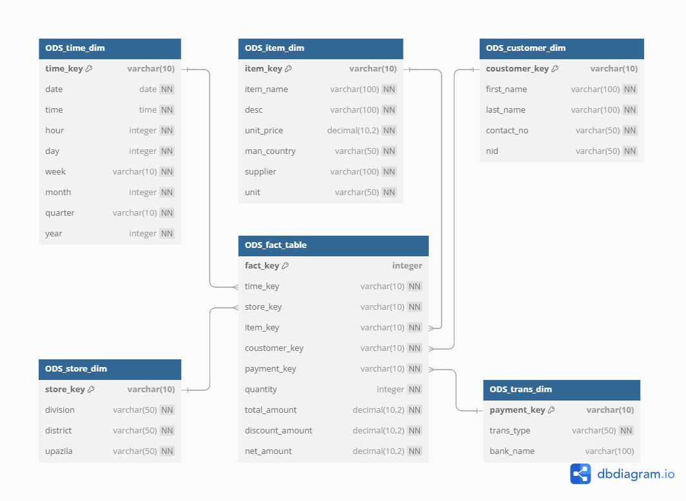

## Project Description

This is a Data Warehouse/ETL project that implements a star schema design for retail data analysis. The project includes:

### Data Structure
- Fact table containing transactional data
- Dimension tables:
  - Customer dimension
  - Store dimension
  - Item dimension
  - Time dimension
  - Transaction dimension

### Project Components
- Raw data files in CSV format
- Database schemas and table definitions
- SQL queries for data analysis
- Database backup and restore procedures

### Purpose
This data warehouse is designed to facilitate business intelligence and analytics operations, enabling efficient querying and analysis of retail transactions across different dimensions like customer behavior, store performance, and product sales.

### Star Schema

## How to Restore a Database from a Backup (.bak)
1. Right-click on Databases in SQL Server Management Studio (SSMS)

2. Select Restore Database...

3. In the restore wizard:

- Choose Device

- Click ... and browse to your .bak file

4. Follow the wizard steps and click OK to restore the database
